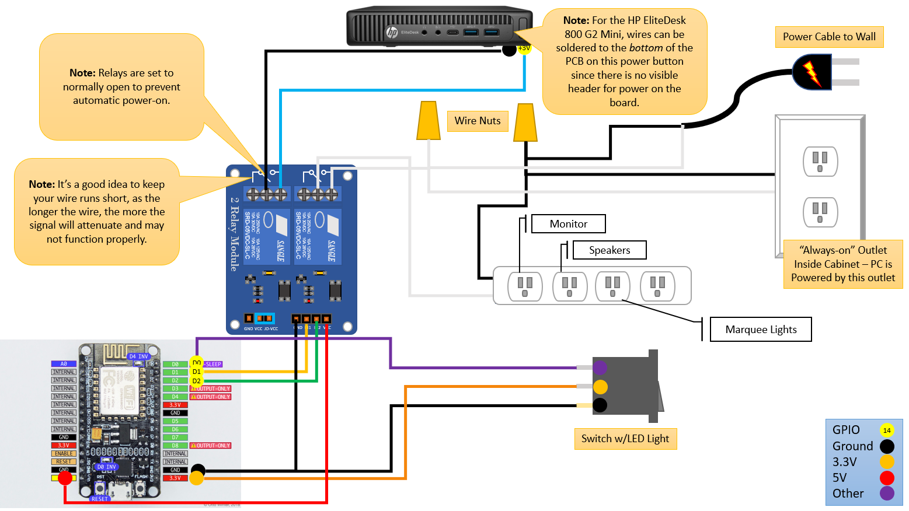

# Arcade Power Control (ESPHome Edition)
## ESP8266 NodeMCU (Arduino) Based Power Control for an Arcade Cabinet

***Note:*** *This project is continuously evolving, and thus this readme will likely be improved over time, as I find the inspiration to make adjustments.  That being said, I'm sure there will be many errors that I have overlooked or sections that I haven't updated.*

This project was somewhat inspired by the YouTube series "I Like to Make Stuff", who built an arcade cabinet with motion control power control (https://youtu.be/DVy6U8SdQnI).  Personally, I didn't care for the motion control, but definitely wanted to have a button that could coordinate turning the Host PC off/on gracefully and also control all of the other components via a switchable power strip.  I happened to have most of the components laying around, so I got to setting it up.

***WARNING:*** *Working with high voltage electrical systems is dangerous and should only be attempted by experienced or qualified individuals.  The creator of this project is in no way liable for any harm that may come to you or your property.*

## Hardware

The component list:

* **NodeMCU** - The star of the show ESP8266 based board that can be found very inexpensively on many online outlets. 
* **Switch** - I used a SPST switch with a built-in LED ([Amazon Link](https://www.amazon.com/dp/B012IJ3BBK/ref=cm_sw_em_r_mt_dp_U_YcC7CbAPGBESA)).  I'm not sure I would recommend this switch as it seems to be a little... flaky.  Conceivably you can use any SPST switch, or if you would like you can swap out for a momentary switch and modify the code a little.  
* **2-Channel Relay** - I used a four channel relay that I had laying around, however a 2-channel should work just as well.  [Amazon Link](https://www.amazon.com/dp/B0057OC6D8/ref=cm_sw_em_r_mt_dp_U_jtppCb3FQ787B)
* **Wire** - Jumper wire and breadboard for connecting things together.
* **Outlet** - Standard Wall Outlet
* **Power Strip** - Standard Power Strip
* **Romex Wire** - Three wire Romex, normally used for home wiring.  
* **Outlet Box** - Tuck those wires away safely.  
* **Grounded Power Plug** - This is the power plug used to connect to the mains power.  You'll need a power cable if you don't already have one laying around.  [Amazon Link](https://www.amazon.com/gp/product/B078N95379)



## Software Installation

### Install ESPHome
https://esphome.io/guides/installing_esphome.html

```bash
$ pip3 install --user esphome
```

### (SKIP) Create Template / Environment

This step creates a blank template.  So maybe skip this unless you want to start from scratch. 

```bash
$ esphome wizard arcade_esphome.yaml
```

### Write Firmware to ESP8266

```bash
$ esphome run arcade_esphome.yaml
```

## Usage

Once the firmware is flashed to the device, you are now ready to control it via the physical switch, or via Home Assistant (native integration), and the WebUI (http://arcadepower.local) on your local network.  

## Credits

Concept, documentation, schematics, and YAML for this project were created by Ben Parmeter (2022). Check out my other projects on [github](https://github.com/nebhead). If you enjoy this software and feel the need to donate a cup of coffee, a frosty beer or a bottle of wine to the developer you can click [here](https://paypal.me/benparmeter).

Of course, none of this project would be available without the wonderful and amazing folks below.  If I forgot anyone please don't hesitate to let me know.  

* **ESPHome** - This is an absolutely amazing project which allowed me to put this entire system together over the course of a few hours on a weekend.  I was previously working on a scratch-built script that essentially did the same thing, but I realized I could do this project in a fraction of the time with the very easy to use ESPHome framework.  Kudos to this team.  [esphome.io](http://esphome.io) 

## Licensing

This project is licensed under the MIT license.

```
MIT License

Copyright (c) 2022 Ben Parmeter and Contributors

Permission is hereby granted, free of charge, to any person obtaining a copy
of this software and associated documentation files (the "Software"), to deal
in the Software without restriction, including without limitation the rights
to use, copy, modify, merge, publish, distribute, sublicense, and/or sell
copies of the Software, and to permit persons to whom the Software is
furnished to do so, subject to the following conditions:

The above copyright notice and this permission notice shall be included in all
copies or substantial portions of the Software.

THE SOFTWARE IS PROVIDED "AS IS", WITHOUT WARRANTY OF ANY KIND, EXPRESS OR
IMPLIED, INCLUDING BUT NOT LIMITED TO THE WARRANTIES OF MERCHANTABILITY,
FITNESS FOR A PARTICULAR PURPOSE AND NONINFRINGEMENT. IN NO EVENT SHALL THE
AUTHORS OR COPYRIGHT HOLDERS BE LIABLE FOR ANY CLAIM, DAMAGES OR OTHER
LIABILITY, WHETHER IN AN ACTION OF CONTRACT, TORT OR OTHERWISE, ARISING FROM,
OUT OF OR IN CONNECTION WITH THE SOFTWARE OR THE USE OR OTHER DEALINGS IN THE
SOFTWARE.
```
